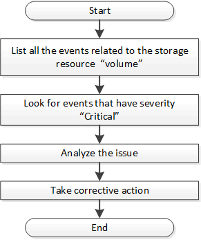

= 이벤트 API를 사용하여 스토리지 객체의 문제 확인
:allow-uri-read: 
:icons: font
:imagesdir: ../media/

[role="lead"]
데이터 센터의 스토리지 객체가 임계값을 넘으면 해당 이벤트에 대한 알림을 받게 됩니다.  이 알림을 사용하면 문제를 분석하고 다음 방법으로 시정 조치를 취할 수 있습니다. `events` 아피스.

이 워크플로는 볼륨을 리소스 개체로 예로 들어 설명합니다.  당신은 사용할 수 있습니다 `events` 볼륨과 관련된 이벤트 목록을 검색하고, 해당 볼륨의 중요한 문제를 분석한 다음, 문제를 바로잡기 위한 시정 조치를 취하는 API입니다.

시정 조치를 취하기 전에 다음 단계에 따라 볼륨의 문제를 확인하세요.

.단계
. 데이터 센터의 볼륨에 대한 중요한 Active IQ Unified Manager 이벤트 알림을 분석합니다.
. /management-server/events API에서 다음 매개변수를 사용하여 볼륨의 모든 이벤트를 쿼리합니다.
`"*resource_type": "volume*"`
`"*severity": "critical*"`
+
[cols="3*"]
|===
| 범주 | HTTP 동사 | 길 

 a| 
관리 서버
 a| 
얻다
 a| 
/관리-서버/이벤트

|===
. 출력을 보고 특정 볼륨의 문제를 분석합니다.
. Unified Manager REST API나 웹 UI를 사용하여 필요한 작업을 수행하여 문제를 해결합니다.

