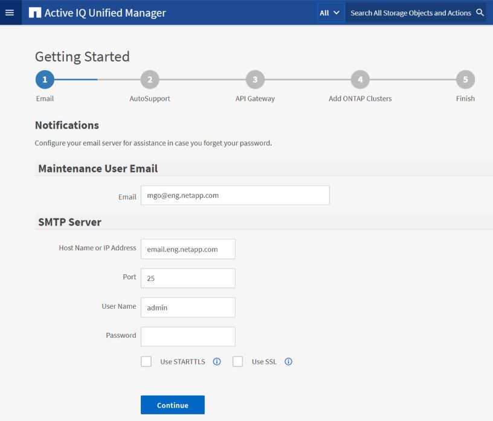

= Unified Manager 웹 UI의 초기 설정을 수행합니다.
:allow-uri-read: 
:icons: font
:imagesdir: ../media/

[role="lead"]
Unified Manager를 사용하려면 먼저 NTP 서버, 유지 관리 사용자 이메일 주소, SMTP 서버 호스트, ONTAP 클러스터 추가를 포함한 초기 설정 옵션을 구성해야 합니다.

.시작하기 전에
다음 작업을 수행했어야 합니다.

* 설치 후 제공된 URL을 사용하여 Unified Manager 웹 UI를 시작했습니다.
* 설치 중에 생성된 유지 관리 사용자 이름 및 비밀번호(Linux 설치의 경우 umadmin 사용자)를 사용하여 로그인했습니다.

Active IQ Unified Manager 시작하기 페이지는 웹 UI에 처음 액세스할 때만 나타납니다.  아래 페이지는 VMware에 설치한 것입니다.

나중에 이러한 옵션을 변경하려면 Unified Manager 왼쪽 탐색 창의 일반 옵션에서 원하는 옵션을 선택하면 됩니다.  NTP 설정은 VMware 설치에만 적용되며, 나중에 Unified Manager 유지 관리 콘솔을 사용하여 변경할 수 있습니다.

.단계
. Active IQ Unified Manager 초기 설정 페이지에서 유지 관리 사용자 이메일 주소, SMTP 서버 호스트 이름 및 추가 SMTP 옵션, NTP 서버(VMware 설치에만 해당)를 입력합니다. 그런 다음 *계속*을 클릭하세요.
+
[NOTE]
====
*STARTTLS 사용* 또는 *SSL 사용* 옵션을 선택한 경우 *계속* 버튼을 클릭하면 인증서 페이지가 표시됩니다.  인증서 세부 정보를 확인하고 인증서를 수락하여 웹 UI의 초기 설정을 계속 진행합니다.

====
. AutoSupport 페이지에서 *동의 및 계속*을 클릭하여 Unified Manager에서 NetAppActive IQ로 AutoSupport 메시지를 보내는 기능을 활성화합니다.
+
AutoSupport 콘텐츠를 보내기 위해 인터넷 접속을 제공하는 프록시를 지정해야 하는 경우 또는 AutoSupport 비활성화하려면 웹 UI에서 *일반* > * AutoSupport* 옵션을 사용하세요.

. Red Hat 시스템에서 umadmin 사용자 비밀번호를 기본 "`admin`" 문자열에서 개인화된 문자열로 변경합니다.
. API Gateway 설정 페이지에서 ONTAP REST API를 사용하여 모니터링하려는 ONTAP 클러스터를 Unified Manager에서 관리할 수 있는 API Gateway 기능을 사용할지 여부를 선택합니다. 그런 다음 *계속*을 클릭하세요.
+
나중에 웹 UI에서 *일반* > *기능 설정* > *API 게이트웨이*를 선택하여 이 설정을 활성화하거나 비활성화할 수 있습니다.  API에 대한 자세한 내용은 다음을 참조하세요.link:../api-automation/concept_get_started_with_um_apis.html["Active IQ Unified Manager REST API 시작하기"] .

. Unified Manager에서 관리할 클러스터를 추가한 후 *다음*을 클릭합니다.  관리하려는 각 클러스터에 대해 사용자 이름과 비밀번호 자격 증명과 함께 호스트 이름 또는 클러스터 관리 IP 주소(IPv4 또는 IPv6)가 있어야 합니다. 사용자는 "`admin`" 역할이 있어야 합니다.
+
이 단계는 선택 사항입니다.  나중에 웹 UI의 *저장소 관리* > *클러스터 설정*에서 클러스터를 추가할 수 있습니다.

. 요약 페이지에서 모든 설정이 올바른지 확인하고 *마침*을 클릭합니다.

시작하기 페이지가 닫히고 Unified Manager 대시보드 페이지가 표시됩니다.
