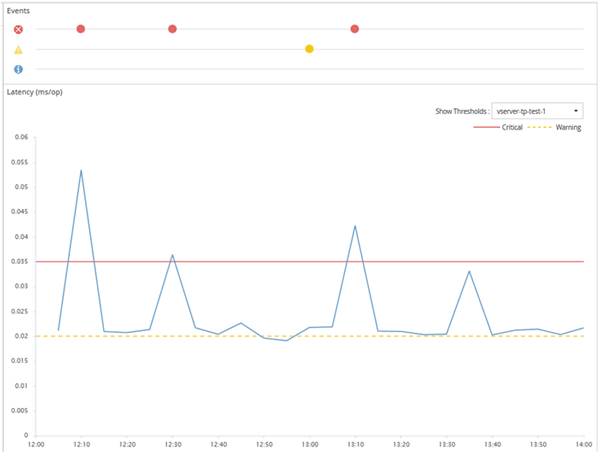

= 사용자 정의 성능 임계값 정책의 작동 방식
:allow-uri-read: 
:icons: font
:imagesdir: ../media/

[role="lead"]
클러스터에 성능 문제가 발생하고 있음을 스토리지 관리자에게 알리기 위해 이벤트를 스토리지 관리자에게 전송할 수 있도록 스토리지 개체(예: 집계 및 볼륨)에 성능 임계값 정책을 설정합니다.

다음을 수행하여 저장소 개체에 대한 성능 임계값 정책을 만듭니다.

* 저장 객체 선택
* 해당 개체와 연관된 성능 카운터 선택
* 경고 및 위험 상황으로 간주되는 성능 카운터 상한을 정의하는 값 지정
* 카운터가 상한을 초과해야 하는 기간을 정의하는 기간 지정

예를 들어, 볼륨에 성능 임계값 정책을 설정하면 해당 볼륨의 IOPS가 10분 연속으로 초당 750개 작업을 초과할 때마다 중요 이벤트 알림을 받을 수 있습니다.  동일한 임계값 정책은 IOPS가 초당 500개 작업을 10분 동안 초과할 경우 경고 이벤트가 전송되도록 지정할 수도 있습니다.

[NOTE]
====
현재 릴리스에서는 카운터 값이 임계값 설정을 초과할 때 이벤트를 전송하는 임계값을 제공합니다.  카운터 값이 임계값 설정 아래로 떨어지면 이벤트를 전송하는 임계값을 설정할 수 없습니다.

====
다음은 경고 임계값(노란색 아이콘)이 1:00에 위반되었고, 위험 임계값(빨간색 아이콘)이 12:10, 12:30, 1:10에 위반되었음을 나타내는 예시 카운터 차트입니다.

임계값 위반은 지정된 기간 동안 지속적으로 발생해야 합니다.  어떤 이유로든 임계값이 한도 값 아래로 떨어지면 후속 위반은 새로운 기간의 시작으로 간주됩니다.

일부 클러스터 개체와 성능 카운터를 사용하면 이벤트가 생성되기 전에 두 개의 성능 카운터가 최대 한도를 초과해야 하는 조합 임계값 정책을 만들 수 있습니다.  예를 들어, 다음 기준을 사용하여 임계값 정책을 만들 수 있습니다.

|===
| 클러스터 객체 | 성능 카운터 | 경고 임계값 | 임계 임계값 | 지속 

 a| 
용량
 a| 
숨어 있음
 a| 
10밀리초
 a| 
20밀리초
 a| 
15분

 a| 
골재
 a| 
이용
 a| 
65%
 a| 
85%
 a| 

|===
두 개의 클러스터 객체를 사용하는 임계값 정책은 두 조건이 모두 위반될 때만 이벤트를 생성합니다.  예를 들어, 표에 정의된 임계값 정책을 사용하면 다음과 같습니다.

|===
| 볼륨 지연 시간이 평균화되면... | 그리고 전체 디스크 활용도는... | 그 다음에... 

 a| 
15밀리초
 a| 
50%
 a| 
아무런 사건도 보고되지 않았습니다.

 a| 
15밀리초
 a| 
75%
 a| 
경고 이벤트가 보고되었습니다.

 a| 
25밀리초
 a| 
75%
 a| 
경고 이벤트가 보고되었습니다.

 a| 
25밀리초
 a| 
90%
 a| 
중대한 사건이 보고되었습니다.

|===