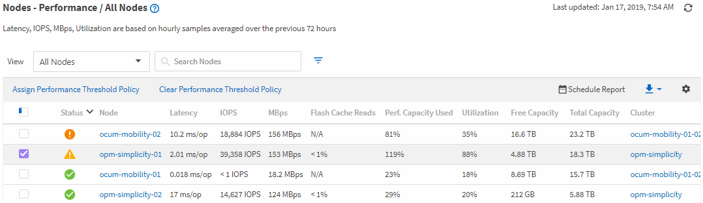

= 성능 인벤토리 페이지를 사용하여 성능 모니터링
:allow-uri-read: 
:icons: font
:imagesdir: ../media/

[role="lead"]
개체 인벤토리 성능 페이지에는 개체 유형 범주 내 모든 개체의 성능 정보, 성능 이벤트 및 개체 상태가 표시됩니다.  이를 통해 클러스터 내 각 개체의 성능 상태를 한눈에 파악할 수 있습니다. 예를 들어 모든 노드나 모든 볼륨에 대한 성능 상태를 파악할 수 있습니다.

객체 인벤토리 성능 페이지는 객체 상태에 대한 전반적인 개요를 제공하여 모든 객체의 전반적인 성능을 평가하고 객체 성능 데이터를 비교할 수 있도록 해줍니다.  검색, 정렬, 필터링을 통해 객체 인벤토리 페이지의 콘텐츠를 구체화할 수 있습니다.  이 기능은 객체 성능을 모니터링하고 관리할 때 유용합니다. 성능 문제가 있는 객체를 빠르게 찾아 문제 해결 프로세스를 시작할 수 있기 때문입니다.

기본적으로 성능 인벤토리 페이지의 개체는 개체 성능 중요도에 따라 정렬됩니다.  새로운 중요 성능 이벤트가 발생한 객체가 먼저 나열되고, 경고 이벤트가 발생한 객체가 두 번째로 나열됩니다.  이를 통해 해결해야 할 문제에 대한 즉각적인 시각적 표시가 제공됩니다.  모든 성과 데이터는 72시간 평균을 기준으로 합니다.

객체 이름 열에서 객체 이름을 클릭하면 객체 인벤토리 성능 페이지에서 객체 세부 정보 페이지로 쉽게 이동할 수 있습니다.  예를 들어, 성능/모든 노드 인벤토리 페이지에서 *노드* 열에 있는 노드 객체를 클릭합니다.  객체 세부 정보 페이지는 활성 이벤트의 나란히 비교를 포함하여 선택된 객체에 대한 심층적인 정보와 세부 정보를 제공합니다.
