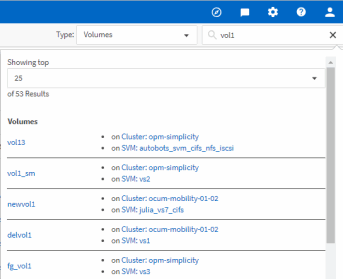

= 저장소 객체 검색
:allow-uri-read: 
:icons: font
:imagesdir: ../media/

[role="lead"]
특정 객체에 빠르게 액세스하려면 메뉴 막대 상단의 *모든 저장소 객체 검색* 필드를 사용하면 됩니다.  모든 개체에 대한 글로벌 검색 방법을 사용하면 유형별로 특정 개체를 빠르게 찾을 수 있습니다.  검색 결과는 스토리지 객체 유형별로 정렬되며 드롭다운 메뉴를 사용하여 필터링할 수 있습니다.  유효한 검색에는 최소 3개의 문자가 포함되어야 합니다.

글로벌 검색에서는 전체 결과 수가 표시되지만, 상위 25개 검색 결과에만 접근할 수 있습니다.  이러한 이유로 글로벌 검색 기능은 빠르게 찾고 싶은 항목을 알고 있다면 특정 항목을 찾는 단축 도구로 생각할 수 있습니다.  완전한 검색 결과를 얻으려면 객체 인벤토리 페이지의 검색과 관련 필터링 기능을 사용하세요.

드롭다운 상자를 클릭하고 *전체*를 선택하면 모든 개체와 이벤트를 동시에 검색할 수 있습니다.  또는 드롭다운 상자를 클릭하여 개체 유형을 지정할 수 있습니다.  *모든 저장소 개체 검색* 필드에 개체 또는 이벤트 이름을 최소 3자 이상 입력한 다음, *Enter* 키를 누르면 다음과 같은 검색 결과가 표시됩니다.

* 클러스터: 클러스터 이름
* 노드: 노드 이름
* 집계: 집계 이름
* SVM: SVM 이름
* 볼륨: 볼륨 이름
* LUN: LUN 경로

[NOTE]
====
LIF와 포트는 글로벌 검색창에서 검색할 수 없습니다.

====
이 예에서는 드롭다운 상자에 볼륨 개체 유형이 선택되어 있습니다.  *모든 저장소 개체 검색* 필드에 "`vol`"을 입력하면 해당 문자가 포함된 이름을 가진 모든 볼륨 목록이 표시됩니다.  객체 검색의 경우, 검색 결과를 클릭하면 해당 객체의 성능 탐색기 페이지로 이동할 수 있습니다.  이벤트 검색의 경우, 검색 결과에서 항목을 클릭하면 이벤트 세부 정보 페이지로 이동합니다.
