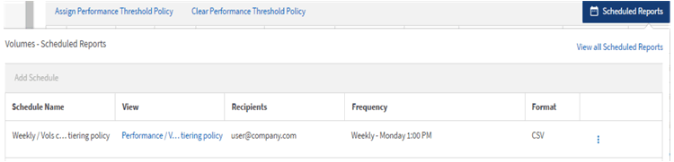

= 빠른 시작 보고
:allow-uri-read: 
:icons: font
:imagesdir: ../media/

[role="lead"]
샘플 사용자 정의 보고서를 만들어서 뷰를 탐색하고 보고서를 예약하는 방법을 알아보세요.  이 빠른 시작 보고서는 비활성(콜드) 데이터가 상당히 많기 때문에 클라우드 계층으로 이동하는 것이 좋을 수 있는 볼륨 목록을 찾아줍니다.  성과: 모든 볼륨 보기를 열고 필터와 열을 사용하여 보기를 사용자 지정하고, 사용자 지정 보기를 보고서로 저장하고, 보고서를 일주일에 한 번 공유하도록 예약합니다.

.시작하기 전에
* 애플리케이션 관리자 또는 스토리지 관리자 역할이 있어야 합니다.
* FabricPool 집계를 구성하고 해당 집계에 볼륨이 있어야 합니다.

다음 단계에 따라 진행하세요.

* 기본 보기 열기
* 데이터를 필터링하고 정렬하여 열을 사용자 정의합니다.
* 뷰를 저장하세요
* 사용자 정의 보기에 대한 보고서 생성을 예약합니다.

.단계
. 왼쪽 탐색 창에서 *저장소* > *볼륨*을 클릭합니다.
. 보기 메뉴에서 *성능* > *모든 볼륨*을 선택합니다.
. *표시/숨기기*를 클릭하여 보기에 "디스크 유형" 열이 나타나는지 확인하세요.
+
image::../media/show_hide_3.png[표시/숨기기 메뉴의 드롭다운 목록을 보여주는 UI 스크린샷입니다.]

+
보고서에 중요한 필드가 포함된 보기를 만들려면 다른 열을 추가하거나 제거하세요.

. "디스크 유형" 열을 "클라우드 권장 사항" 열 옆으로 끌어다 놓습니다.
. 필터 아이콘을 클릭하여 다음 세 가지 필터를 추가한 다음 *필터 적용*을 클릭합니다.
+
** 디스크 유형에는 FabricPool 포함되어 있습니다.
** 클라우드 추천에는 계층이 포함되어 있습니다.
** 10GB 이상의 콜드 데이터image:../media/filter_cold_data_2.png["필터 옵션에서 필터를 적용하는 방법을 보여주는 UI 스크린샷입니다."]

+
각 필터는 논리적 AND로 결합되어 있으므로 반환된 모든 볼륨이 모든 기준을 충족해야 합니다.  최대 5개의 필터를 추가할 수 있습니다.

. 콜드 데이터 열의 상단을 클릭하면 결과가 정렬되어 콜드 데이터가 가장 많은 볼륨이 보기의 맨 위에 표시됩니다.
. 보기가 사용자 정의된 경우 보기 이름은 저장되지 않은 보기입니다.  뷰가 표시하는 내용을 반영하도록 뷰의 이름을 지정합니다(예: "`Vols change tiering policy`").  완료되면 체크 표시를 클릭하거나 *Enter* 키를 눌러 새 이름으로 보기를 저장합니다.
+
image::../media/report_vol_code_data_2.png[필수 열이 올바른 순서로 나열된 Vols 변경 계층화 정책 페이지를 보여주는 UI 스크린샷입니다.]

. 일정을 정하거나 공유하기 전에 보고서를 *CSV*, *Excel* 또는 *PDF* 파일로 다운로드하여 결과를 확인하세요.
+
Microsoft Excel(CSV 또는 Excel)이나 Adobe Acrobat(PDF) 등 설치된 애플리케이션으로 파일을 열거나 파일을 저장합니다.

+
[NOTE]
====
Excel 파일로 보기를 다운로드하면 복잡한 필터, 정렬, 피벗 테이블 또는 차트를 사용하여 보고서를 더욱 세부적으로 사용자 지정할 수 있습니다.  Excel에서 파일을 연 후 고급 기능을 사용하여 보고서를 사용자 지정하세요.  만족스러우면 Excel 파일을 업로드하세요.  이 파일은 사용자 정의가 적용되어 보고서가 실행될 때 보기에 적용됩니다.

====
+
Excel을 사용하여 보고서를 사용자 지정하는 방법에 대한 자세한 내용은 _Microsoft Excel 보고서 샘플_을 참조하세요.

. 인벤토리 페이지에서 *예약된 보고서* 버튼을 클릭하세요.  이 경우 볼륨과 관련된 모든 예약된 보고서가 목록에 나타납니다.
+

. *일정 추가*를 클릭하면 보고서 일정 페이지에 새 행이 추가되어 새 보고서에 대한 일정 특성을 정의할 수 있습니다.
. 보고서 이름을 입력하고 다른 보고서 필드를 완료한 다음 확인 표시(image:../media/blue_check.gif[""] ) 행의 끝에.
+
보고서는 테스트로 즉시 전송됩니다.  그 후, 보고서가 생성되어 지정된 빈도로 등록된 수신자에게 이메일로 전송됩니다.

+
다음 샘플 보고서는 CSV 형식입니다.

+
image::../media/csv_sample_report.gif[CSV 형식의 샘플 보고서를 보여주는 UI 스크린샷입니다.]

+
다음 샘플 보고서는 PDF 형식입니다.

+
image::../media/pdf_sample_report.gif[PDF 형식의 샘플 보고서를 보여주는 UI 스크린샷입니다.]

보고서에 표시된 결과를 기반으로 ONTAP System Manager나 ONTAP CLI를 사용하여 특정 볼륨의 계층화 정책을 "`auto`" 또는 "`all`"로 변경하여 더 많은 콜드 데이터를 클라우드 계층으로 오프로드할 수 있습니다.
