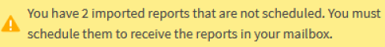

= 가져온 .rptdesign 보고서 일정
:allow-uri-read: 
:icons: font
:imagesdir: ../media/

[role="lead"]
Unified Manager의 이전 릴리스에서 생성되어 가져온 기존 보고서를 예약할 수 있습니다.

가져온 보고서를 예약하려면 다음이 필요합니다.

* 이전 Unified Manager 릴리스에서 가져온 BIRT 디자인 .rptdesign 파일 보고서
* Unified Manager 9.6 GA 이상으로 업그레이드할 때 적용 가능

Unified Manager 9.6 GA 이상으로 업그레이드한 후 보고서 일정 페이지에 가져온 보고서가 나열됩니다.  이러한 보고서의 일정을 편집하여 수신자 이메일 주소, 빈도, 형식(PDF 또는 CSV)을 지정할 수 있습니다.  그렇지 않으면 이러한 보고서를 Unified Manager UI에서 편집하거나 볼 수 없습니다.

.단계
. 보고서 일정 페이지를 엽니다.  보고서를 가져온 경우 메시지가 나타납니다.
+

. *보기* 이름을 클릭하면 보고서 생성에 사용되는 SQL 쿼리가 표시됩니다.
+
image::../media/importedreport1.png[보고서 생성에 사용된 SQL 쿼리를 보여주는 UI 스크린샷입니다.]

. 더 많은 아이콘을 클릭하세요image:../media/more_icon.gif[""] , *편집*을 클릭하고 보고서 일정 세부 정보를 정의한 다음 보고서를 저장합니다.
+
[NOTE]
====
또한 더 보기 아이콘에서 원치 않는 보고서를 삭제할 수도 있습니다.image:../media/more_icon.gif[""] .

====

