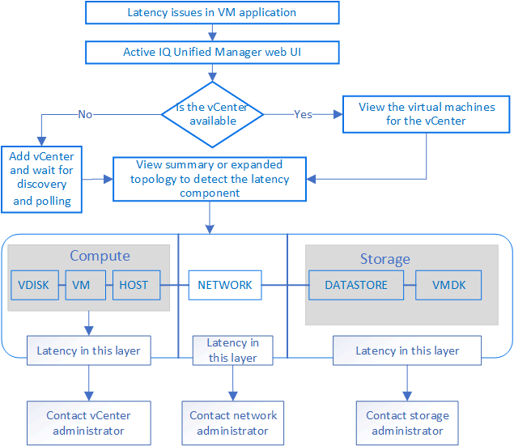

= VMware 가상 인프라 모니터링
:allow-uri-read: 
:icons: font
:imagesdir: ../media/

[role="lead"]
Active IQ Unified Manager 가상 인프라의 가상 머신(VM)에 대한 가시성을 제공하고 가상 환경에서 스토리지 및 성능 문제를 모니터링하고 해결할 수 있도록 해줍니다.  이 기능을 사용하면 스토리지 환경에서 지연 문제가 있는지, 또는 vCenter Server에서 보고된 성능 이벤트가 있는지 확인할 수 있습니다.

ONTAP 에서의 일반적인 가상 인프라 배포에는 컴퓨팅, 네트워크 및 스토리지 계층에 걸쳐 분산된 다양한 구성 요소가 있습니다.  VM 애플리케이션의 성능 지연은 각 계층의 다양한 구성 요소가 겪는 지연 시간의 조합으로 인해 발생할 수 있습니다.  이 기능은 가상 환경에서 성능 문제를 분석하고 문제가 발생한 구성 요소를 파악해야 하는 스토리지 및 vCenter Server 관리자와 IT 전문가에게 유용합니다.

이제 VMware 섹션의 vCenter 메뉴에서 vCenter Server에 액세스할 수 있습니다.  나열된 각 가상 머신의 미리보기에는 새 브라우저에서 vCenter Server를 시작하는 TOPOLOGY VIEW에 *VCENTER SERVER* 링크가 있습니다.  *토폴로지 확장* 버튼을 사용하여 vCenter Server를 시작하고 *vCenter에서 보기* 버튼을 클릭하여 vCenter Server의 데이터 저장소를 볼 수도 있습니다.

Unified Manager는 가상 환경의 기본 하위 시스템을 토폴로지 뷰로 표시하여 컴퓨팅 노드, 네트워크 또는 스토리지에서 지연 문제가 발생했는지 여부를 확인합니다.  또한 이 뷰에서는 성능 지연을 유발하는 특정 객체를 강조 표시하여 수정 조치를 취하고 기본 문제를 해결합니다.

ONTAP 스토리지에 배포된 가상 인프라에는 다음 개체가 포함됩니다.

* vCenter Server: 가상 환경에서 VMware VM, ESXi 호스트 및 모든 관련 구성 요소를 관리하기 위한 중앙 집중식 제어 평면입니다.  vCenter Server에 대한 자세한 내용은 VMware 설명서를 참조하세요.
* 호스트: VMware의 가상화 소프트웨어인 ESXi를 실행하고 VM을 호스팅하는 물리적 또는 가상 시스템입니다.
* 데이터스토어: 데이터스토어는 ESXi 호스트에 연결된 가상 스토리지 개체입니다.  데이터스토어는 LUN이나 볼륨과 같은 ONTAP 의 관리 가능한 스토리지 엔티티로, 로그 파일, 스크립트, 구성 파일, 가상 디스크와 같은 VM 파일의 저장소로 사용됩니다.  이들은 SAN이나 IP 네트워크 연결을 통해 환경 내의 호스트에 연결됩니다.  ONTAP 외부의 데이터스토어가 vCenter Server에 매핑된 경우 Unified Manager에서 지원되거나 표시되지 않습니다.
* VM: VMware 가상 머신.
* 가상 디스크: VMDK라는 확장명을 가진 VM에 속한 데이터 저장소의 가상 디스크입니다.  가상 디스크의 데이터는 해당 VMDK에 저장됩니다.
* VMDK: 가상 디스크에 대한 저장 공간을 제공하는 데이터스토어의 가상 머신 디스크입니다.  각 가상 디스크에는 해당 VMDK가 있습니다.

이러한 객체는 VM 토폴로지 뷰에 표현됩니다.

* ONTAP 에서의 VMware 가상화 *

image::../media/vm_deployment.gif[VM 배포]

*사용자 워크플로*

다음 다이어그램은 VM 토폴로지 뷰를 사용하는 일반적인 사용 사례를 보여줍니다.

[[what-is-not-supported]]
== 지원되지 않는 사항

* ONTAP 외부에 있고 vCenter Server 인스턴스에 매핑된 데이터스토어는 Unified Manager에서 지원되지 않습니다.  해당 데이터스토어에 가상 디스크가 있는 VM도 지원되지 않습니다.
* 여러 LUN에 걸쳐 있는 데이터 저장소는 지원되지 않습니다.
* 데이터 LIF(액세스 엔드포인트)를 매핑하기 위해 NAT(네트워크 주소 변환)를 사용하는 데이터 저장소는 지원되지 않습니다.
* 여러 LIF 구성에서 동일한 IP 주소를 가진 서로 다른 클러스터에 볼륨이나 LUN을 데이터 저장소로 내보내는 것은 Unified Manager가 어떤 데이터 저장소가 어떤 클러스터에 속하는지 식별할 수 없기 때문에 지원되지 않습니다.
+
예: 클러스터 A에 데이터 저장소 A가 있다고 가정합니다. 데이터 저장소 A는 동일한 IP 주소 xxxx로 데이터 LIF를 통해 내보내지고 VM A는 이 데이터 저장소에 생성됩니다.  마찬가지로 클러스터 B에는 데이터 저장소 B가 있습니다. 데이터 저장소 B는 동일한 IP 주소 xxxx를 사용하여 데이터 LIF를 통해 내보내지고 VM B는 데이터 저장소 B에 생성됩니다. UM은 VM A의 토폴로지에 대한 데이터 저장소 A를 해당 ONTAP 볼륨/LUN에 매핑하거나 VM B를 매핑할 수 없습니다.

* 데이터 저장소로는 NAS 및 SAN 볼륨(VMFS의 경우 iSCSI 및 FCP)만 지원되며 가상 볼륨(vVols)은 지원되지 않습니다.
* iSCSI 가상 디스크만 지원됩니다.  NVMe 및 SATA 유형의 가상 디스크는 지원되지 않습니다.
* 이러한 뷰에서는 다양한 구성 요소의 성능을 분석하기 위한 보고서를 생성할 수 없습니다.
* Unified Manager의 가상 인프라에만 지원되는 스토리지 가상 머신(스토리지 VM) 재해 복구(DR) 설정의 경우, 스위치오버 및 스위치백 시나리오에서 활성 LUN을 가리키도록 vCenter Server에서 구성을 수동으로 변경해야 합니다.  수동 개입 없이는 데이터 저장소에 접근할 수 없게 됩니다.

